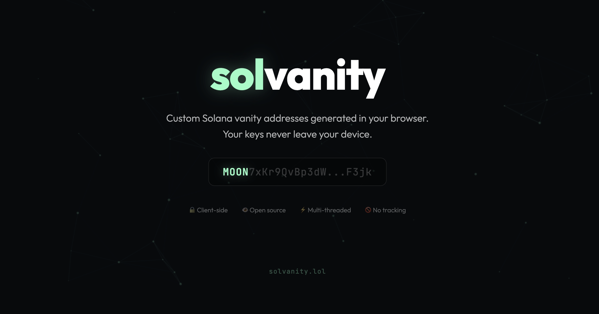

<p align="center">
  
</p>

<h1 align="center">solvanity</h1>

<p align="center">
  <strong>Client-side Solana vanity address generator</strong><br>
  <a href="https://solvanity.lol">solvanity.lol</a>
</p>

<p align="center">
  🔒 Client-side &nbsp;·&nbsp; 👁 Open source &nbsp;·&nbsp; ⚡ Multi-threaded &nbsp;·&nbsp; 🚫 No tracking
</p>

---

## What is this?

**solvanity** lets you generate custom Solana wallet addresses with a prefix and/or suffix of your choice — entirely in your browser. No servers, no accounts, no data collection. Your private keys never leave your device.

## How it works

1. Enter your desired **prefix** and/or **suffix**
2. Click **Start Grinding**
3. WASM-compiled Rust generates Ed25519 keypairs at high speed using multiple Web Workers
4. When a match is found, you get the full keypair — ready to import into Phantom, Solflare, or any Solana wallet

## Tech stack

- **Rust → WASM** — Ed25519 keypair generation compiled to WebAssembly for near-native speed
- **Web Workers** — Multi-threaded grinding using all available CPU cores
- **React + Vite** — Lightweight frontend
- **Vercel** — Hosting & serverless API
- **Upstash Redis** — Address counter

## Security

- All key generation happens **in your browser** via WebAssembly
- Uses `ed25519-dalek` with cryptographically secure randomness (`getrandom` with `js` feature)
- **Zero network requests** during key generation
- No keys are stored, transmitted, or logged — ever
- You can verify this yourself by reading the source code

## Project structure

```
solvanity/
├── grinder/              # Rust WASM crate
│   ├── Cargo.toml
│   └── src/lib.rs        # Ed25519 keypair generation
└── web/                  # React frontend
    ├── api/counter.js    # Serverless address counter
    ├── src/
    │   ├── App.jsx       # Main UI
    │   ├── worker.js     # Web Worker for WASM grinding
    │   └── main.jsx
    ├── index.html
    └── vite.config.js
```

## Build from source

### Prerequisites
- [Rust](https://rustup.rs/) + [wasm-pack](https://rustwasm.github.io/wasm-pack/installer/)
- Node.js 18+

### Build the WASM grinder
```bash
cd grinder
wasm-pack build --target web --release
```

### Run the frontend
```bash
cd web
ln -s ../grinder/pkg src/grinder
npm install
npm run dev
```

## Tips

If you generated a cool address and want to say thanks:

**`uhoh2yhrL6EW5xCG7FNXVXa92ZCnyCzQCeGV3xPJKSq`**

## License

MIT
